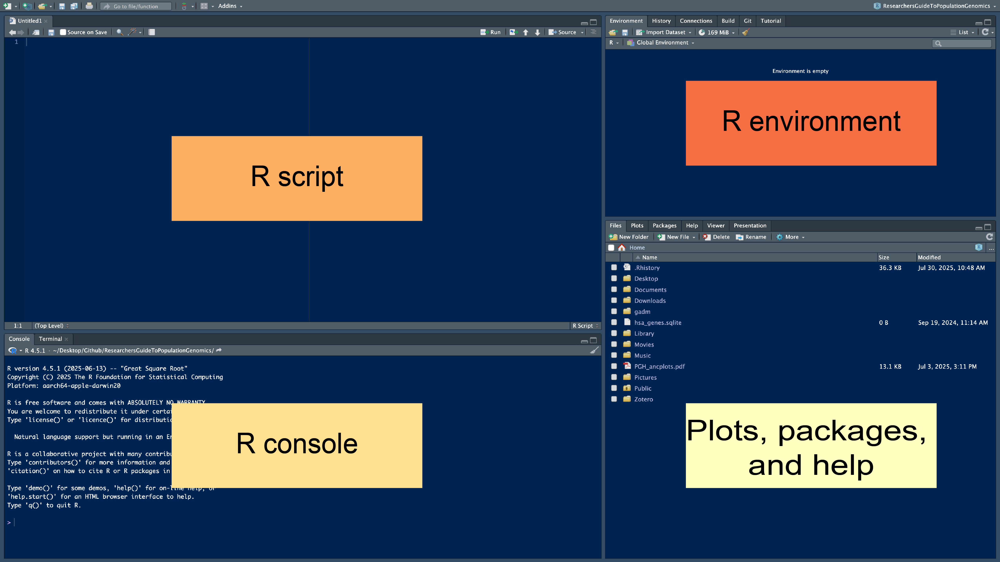

# Introduction to R

*Written by Keaka Farleigh on August 5th, 2025: edited from materials originally developed by Dr. Tereza Jezkova and Alfredo Ascanio*

*Last updated by Keaka Farleigh on August 11th, 2025* 

## Purpose

This tutorial will provide an introduction to the programming language [R](https://www.r-project.org/). I will assume that you have no experience with R and that you are at the beginning of your journey towards becoming an R expert. 

## Files required for this pipeline

None!

## Programs used in this pipeline

 - [R](https://www.r-project.org/) (R core team, 2025)
 - [Rstudio](https://posit.co/download/rstudio-desktop/)


## Notes on this tutorial

The materials in this tutorial were originally developed as part of the [Lambda bioinformatic workshop](https://sites.miamioh.edu/lambda/) at Miami University by Dr. Tereza Jezkova and Alfredo Ascanio. These materials are now presented at Lambda and the Foundations in R workshop at the University of Virginia.

## Overview

We will cover the basics of R and Rstudio before getting some hands-on experience!

## Before we begin

Before we get started, I want to set some expectations. Please give yourself some grace, wherever you are in your journey to becoming an R expert. You are learning a _**new**_ language. There will be failures and you will get error messages you don't understand, but over time it gets easier as you become more fluent. Please do not be discouraged by the failures or errors, see them as a learning opportunity and please reach out if you need any help, ever.  

## What is R?

R is a free and open-source (public) programming language that was developed in the 1990's and published in 2000. It is based on the programming language S, which was developed by Bell labs in the 1970's.

I list some basic facts about R below:

- R can be run on any platform (e.g., Linux, Mac, Windows).

- R has public repositories that hold software that can be downloaded to perform a variety of analyses. These repositories are maintained by volunteers and require software to be documented and adhere to specific rules to be held in the repository.
  - The official repository is the [CRAN](https://cran.r-project.org/).
  - The other major repository is [BioConductor](https://www.bioconductor.org/).
  
- R software can also be hosted and downloaded from other repositories such as [GitHub](https://github.com/), but these repositories do not require specific documentation or require developers to adhere to specific practices (some still do).

- There is (and has been) a large community of R users, so there are a lot of helpful resources online if you have questions or run into any errors. 

## Advantages and disadvantges of R

Advantages

- R is the most popular statistical programming language.
- R is open-source and free.
- R has many help forums online.
- R has an enormous amount of software available to users (currently ~20,000 and growing)
- Available software can be used for things like data mining, machine learning, data visualization, and more! You can also develop and publish software if what you need isn't in the R universe. 

Disadvantages 

- R has a steep learning curve (it is a whole new language after all).
- Different analyses and algorithms are spread across software.
- R is memory intensive because it stores all objects in physical memory. 
- R can be slower then other langauges. 

## What is Rstudio?

Rstudio is an integrated development environment (IDE) for R. Rstudio is also free and open-source. So what is an IDE? An IDE is a software application that allows you to run analyses, develop software, debug code, and more all in a single interface. Rstudio is often used to run R, because, well, R was developed in the 1990's and it looks like it. Rstudio allows us to have a more streamlined interface, see everything that we are working on, actively edit our code, and visualize plots as we go. It is more difficult to do these things in base R. 

## The Rstudio layout

The Rstudio layout has 4 panes or windows. We will walk through each of them. 


```{r Rstudio window, echo=FALSE, eval=TRUE, fig.align='center'}

```

### R console

The R console is where R is run and results will show up unless you assign them to a variable (more on that a little later). The `>` indicates that R is ready for a command, when something is running you will see the `>` go away and a little stop sign by the broom in the top right of the R console will appear. Sometimes, a `+` sign appears. This mean that your command was missing something. Often times, its a missing parentheses or comma. 

Try the code below to see what I am talking about (copy and paste the code into your R console, then hit enter). Can you see why the second line of code didn't run?

```{r Run code, echo=TRUE, eval=FALSE}
working_code <- c(1,2,3,4)

plus_sign <- c(1,2,3
```

### R script

The R script pane is where you write and edit code. The script you write here will be color coded to make it easier to identify different elements of your code, like functions, comments, colors, and number. Parentheses and quotations will be autofilled for you.You can also comment your code by starting the line with a `#`. R will recognize this and will not run this line if you execute your entire script at once. Any scripts saved will have a .R file exstension by default (e.g., myscript.R).

Here is an example of code with a comment:

```{r Comment code, echo=TRUE, eval=FALSE}
# Look, I made a comment
working_code <- c(1,2,3,4)
```


So, how do you run code, you ask?

If your cursor is in Rscript window you can press run at the top of that window. Alternatively, you can press `Ctrl+Enter` or `Command+Return` on a PC or Mac, respectively. 

You can also R code in the R console by typing code after the `>` and then pressing enter. 

### Environment

The Environment window shows you which variables you have created so far and tells you about them. For example, you can see what size they are, what type they are, and sometimes what is inside of them. If you ran the `working_code <- c(1,2,3,4)` line above, you should be able to see a variable called `working_code` that is composed of 4 numbers (1-4). You can also see how much memory is being used by your R session and import files. Importantly, you can save your R workspace, which is all of your objects that you have created in your environment. Think of it as saving a document that you want to pick up where you left off immediately the next time you open it. Saving an R workspace will produce a file with the .Rdata file extension. 

### Plots, Packages, and Help

The plots, packages, and help window has a lot. Any plots that you generate will show up here. You can also see what software you have installed (Packages), check the files you have available (Files), and get help if you have a question about a function or package. 

Try the code below to get help with the `mean` function:

```{r Help code, echo=TRUE, eval=FALSE}
?mean
```

## Working directories

Like other coding languages, R works from within folders, or directories. Think of this as the location where you are doing your work. In this "working directory" you have immediate access to the files in that location, but if you need files from another location you need to either change into that other directory or use a file path to direct R to that file.

Sometimes, you will get an error saying that a file does not exist, even though you can see it in a folder. This is often because you are in the wrong working directory.

Here are a few ways to check and set your working directory:

```{r Working directory, echo=TRUE, eval=FALSE}
# View your working directory
getwd()

# Set your working directory
setwd("/path/to/your/folder")
```

If you are in Rstudio, you can also use your mouse/touch pad to set your working directory. 

Session --> Set Working Directory --> Choose Directory

## Software (e.g., Packages)

The software that is available with R are called packages. These packages are bundles of code, data, and documentation that are compiled so that other people can use them. You have to install these packages the first time that you use them, and you have to load them in every R session that you wish to use them. 

Here is an example of how to install and load the package [dplyr](https://dplyr.tidyverse.org/):

```{r install packages, echo = TRUE, eval = FALSE}
# Install dplyr
install.packages("dplyr")

# Load dplyr
library(dplyr)
```

## Assigning variables

## Types of variables and data

### Vectors

### Data frames

## References
