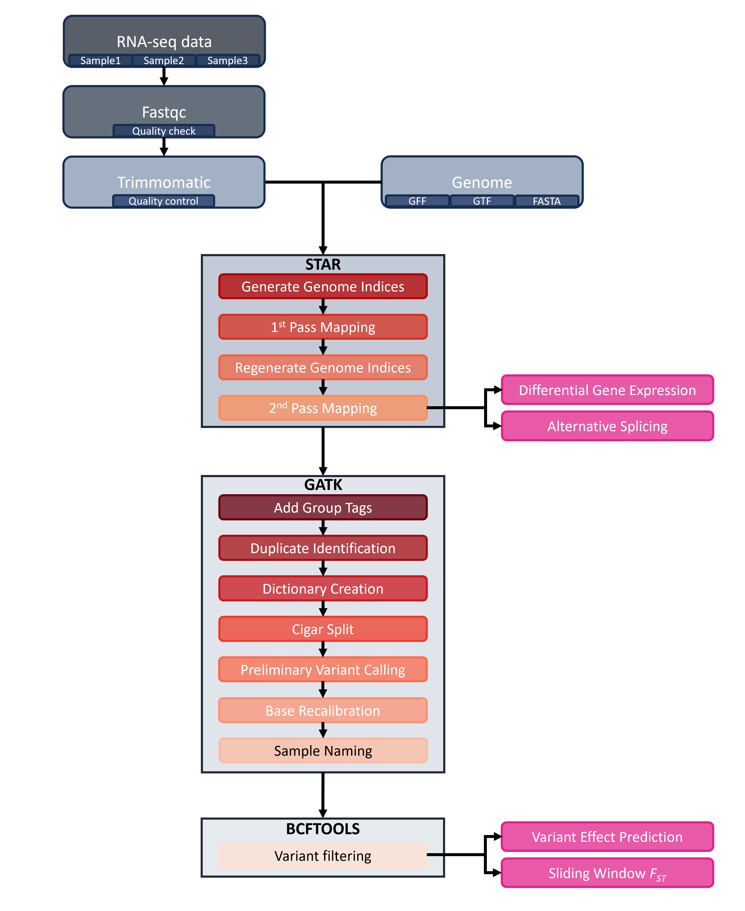

# (PART) Tutorials {-}
# RNA-seq mapping pipeline

*Written by Keaka Farleigh on April 16th, 2024*

*Last updated by Keaka Farleigh on April 21st, 2025*

*Reviewed by: Benjamin A. Akande*

*Tested by: Benjamin A. Akande, Keaka Farleigh*

## Purpose

This tutorial contains code to perform quality control, mapping, and variant calling of demultiplexed bulk RNA-seq samples. The dataset used in this tutorial is unpublished, but I will link to the associated publication once the manuscript is published. 

I developed this pipeline for paired-end (PE) sequencing data and tested it with single-end (SE) sequencing data. I note how and where to change commands for SE data. 


## Files required for this pipeline

 1. Demultiplexed RNA-seq data
 2. Genomic fasta file

## Programs used in this pipeline

 - [bcftools](https://samtools.github.io/bcftools/bcftools.html) (Danecek et al., 2021)
 - [FastQC](https://www.bioinformatics.babraham.ac.uk/projects/fastqc/) (Andrews, 2010)
 - [Trimommatic](https://github.com/usadellab/Trimmomatic) (Bolger et al., 2014)
 - [STAR](https://github.com/alexdobin/STAR) (Dobin et al., 2013)
 - [Picard](https://broadinstitute.github.io/picard/)
 - [GATK](https://gatk.broadinstitute.org/hc/en-us) (McKenna et al., 2010; but see [this website](https://gatk.broadinstitute.org/hc/en-us/articles/360035530852-How-should-I-cite-GATK-in-my-own-publications-) for additional papers published about GATK)

## Notes on this pipeline

This pipeline has been tested on Miami University's [RedHawk High Performace Computing cluster](https://miamioh.edu/research/research-computing-support/services/hpc-cluster/index.html) (HPC) and should work elsewhere, but I cannot guarantee it. 

Additionally, I use batch jobs but have written the pipeline to be interactive (using sh scripts), so reserve compute resources when running this pipeline.  Please reach out if you have any questions or need help running the pipeline or working in an HPC environment. 

Finally, I wrote the for loops in this pipeline to work with fastq, fq.gz, or bam files. In essence, the loops use the file extensions or specific character strings to create a list of files to perform some action on. In most loops, the action is to echo a command into a batch or sh file so that we can save time and do not have to do it ourselves. You can easily adjust these loops by changing the sed command; please [reach out](https://kfarleigh.github.io/contact/) if you have any questions about modifying the loop. 

Let's get started and analyze some data!

## Overview

Analyzing bulk RNA-seq data is complex and feels like a marathon because of the many steps (~14 if you do variant calling). We can lessen our burden by using programs such as STAR (Dobin et al., 2013) and GATK (McKenna et al., 2010). Depending on what analysis you want to do, you may only have to do some of the steps (see Figure 1). 

```{r RNAseq wkflw viz, out.width= "750px", out.height= "1000px", echo=FALSE, eval=TRUE, fig.align='center'}

```

**Figure 1.** RNA-seq analysis workflow. Rounded rectangles indicate steps, and boxes containing multiple rectangles represent programs such as STAR (Dobin et al., 2013) or GATK (McKenna et al., 2010). Pink rectangles indicate analyses that can be performed at specific steps in the workflow. 


## Quality control with FastQC and Trimmomatic

As with any sequencing data, the first thing that we do is quality control. We employ a two-step quality control procedure. First, we use fastqc to analyze reads and manually inspect the output. Second, we use trimmomatic to perform any necessary read clipping, read filtering, or adapter removal.

Assuming that you are in your working directory with all of the demultiplexed files.

``` 
# Load fastqc if you need
module load fastqc

# Run fastqc on everything in the directory
fastqc *
```

After fastqc runs, we have an HTML report for each file in our directory. Open a file and inspect the output by double-clicking it (this may require you to transfer it to your desktop). A lot is here, but we are most concerned with the per-base sequence quality graph. This graph shows us the quality scores across our reads. We expect that most of the quality scores to fall in the green area (above 28), but sometimes we see bases at the beginning or end of the read fall into the yellow (20-28) or red areas (0-20). I recommend trimming the reads to exclude anything outside of the green areas (below 28), but the decision is yours regarding your data. 

But how do I trim the reads or remove reads of low-quality?

We use trimmomatic to clip reads, remove low-quality reads, and exclude any adapters that are still present. I include example code below for an individual file and code to loop commands into a shell script so that you can be more efficient.

The loop first lists any file with _1.fq.gz using ls, which we assume are all your forward reads. We then isolate the sample names to act as a prefix by removing the _1.fq.gz with sed. We then use this as a prefix to name our input and output files rather than doing it by hand. 

You must remove any _2 code to make this loop work for SE data. 

```
### Commands to trim a single individual/file
# Trimmomatic requires java
module load java

# Make a trimmed directory to keep our working directory clean
mkdir ./trimmed

# Run the trimmomatic command
java -jar /home/farleik/Software/trimmomatic-0.39.jar PE Sample1_1.fq.gz\ Sample1_2.fq.gz\ ./trimmed/Sample1_1_paired.fq.gz\ ./trimmed/Sample1_1_unpaired.fq.gz\ ./trimmed/Sample1_2_paired.fq.gz ./trimmed/Sample1_2_unpaired.fq.gz  ILLUMINACLIP:TruSeq3-PE.fa:2:30:10:2:keepBothReads LEADING:3 TRAILING:3 MINLEN:36

### Loop it into a shell file for efficiency 
# This command will create a file named trimmomatic.sh in your working directory
touch trimmomatic.sh

# Trimmomatic requires java so we add the command to load java to the trimmomatic.sh file
echo module load java >> trimmomatic.sh

# We don’t want to clutter up our working directory so we need to create a directory that holds all of the output 
echo mkdir ./trimmed >> trimmomatic.sh

# The for loop to generate the trimmomatic command for each individual/file
for i in `ls -1 *_1.fq.gz | sed 's/\_1.fq.gz//'`; do echo java -jar /home/farleik/Software/trimmomatic-0.39.jar PE ${i}_1.fq.gz\ ${i}_2.fq.gz\ ./trimmed/${i}_1_paired.fq.gz\ ./trimmed/${i}_1_unpaired.fq.gz\ ./trimmed/${i}_2_paired.fq.gz ./trimmed/${i}_2_unpaired.fq.gz  ILLUMINACLIP:TruSeq3-PE.fa:2:30:10:2:keepBothReads LEADING:3 TRAILING:3 MINLEN:36 >> trimmomatic.sh; done

# Trim everything
sh trimmomatic.sh
```

Now that everything is trimmed we can move onto mapping with STAR!

## Mapping with STAR

Mapping the RNA-seq data with STAR is relatively straightforward (it only requires a couple of commands). Still, I encourage you to familiarize yourself with the program by checking out the [manual](https://physiology.med.cornell.edu/faculty/skrabanek/lab/angsd/lecture_notes/STARmanual.pdf). The options I use here are specific for my project. While they may also be relevant to your project, it is best to understand your chosen settings. 

First, we will use our genomic fasta to generate some files used by STAR during the mapping process. We then use a for loop similar to the trimmomatic step where we first isolate a prefix and then use that prefix to name input and output files to map and generate read counts for each individual.

**Note**. GFF read is a part of [cufflinks](https://github.com/cole-trapnell-lab/cufflinks/tree/master). Please see their GitHub for relevant citations.


```
# Load STAR 
module load star-2.7.5a

# Converting GFF to GTF
./gffread Phry_platy.gff -T -o Phry_platy_ann.gtf

# Use the genome fasta to generate files used by STAR during mapping 
STAR --runMode genomeGenerate --genomeDir ./indexes/ --genomeFastaFiles ../../redo_annotation/final_assembly.fa --sjdbGTFfile ./Phry_platy_ann.GTF

# This command will create a file named RNAseq_mapping.sh in your working directory
touch RNAseq_mapping.sh

# Add modulel load command into the shell script
echo module load star-2.7.5a >> RNAseq_mapping.sh

# This command is for PE data
for i in `ls -1 *_1_paired.fq.gz | sed 's/\_1_paired.fq.gz//’ `; do echo STAR --runThreadN 2 --genomeDir /shared/jezkovt_farleik_shared/Platy_RNAseq/Genome/ --readFilesIn ${i}_1_paired.fq.gz ${i}_2_paired.fq.gz --readFilesCommand zcat --limitOutSJcollapsed 2000000 --outFileNamePrefix ./${i} --outSAMtype BAM SortedByCoordinate --limitBAMsortRAM 29000000000 --quantMode GeneCounts >> RNAseq_mapping.sh; done

sh RNAseq_mapping.sh

# This command is for SE data, notice that there is only one input file (--readFilesIn)
for i in `ls -1 *.fastq | sed 's/\.fastq//’ `; do echo STAR --runThreadN 2 --genomeDir /shared/jezkovt_farleik_shared/Platy_RNAseq/Anolis_Data/Genome/ --readFilesIn ${i}.fastq --readFilesCommand zcat --limitOutSJcollapsed 2000000 --outFileNamePrefix ./${i} --outSAMtype BAM SortedByCoordinate --limitBAMsortRAM 29000000000 --quantMode GeneCounts >> Anolis_IndMapping.sh; done
```

Mapping is done, well, maybe. We can use the files output here to perform differential gene expression analysis or weighted gene co-expression analysis analyses. However, if we want to call variants in our RNA-seq data, I recommend following [GATK's best practices](https://gatk.broadinstitute.org/hc/en-us/articles/360035531192-RNAseq-short-variant-discovery-SNPs-Indels-) and using STAR's two-pass method. This method increases sensitivity to novel splice junctions, and in the absence of annotations, it is [strongly recommended](https://github.com/alexdobin/STAR/issues/1616).


We will use the splice junction files generated by STAR (SJ.out.tab files) to re-generate our genome indices. First, we filter out potential false positive splice junctions with few reads, non-canonical junctions, and annotated junctions (see [this discussion](https://groups.google.com/g/rna-star/c/Cpsf-_rLK9I)). 

``` 
# I like to move all of the files to a new directory to be safe
mkdir SJ_files
mv *SJ.out.tab ./SJ_files
cd ./SJ_files

# Filter our splice junction files
cat *.tab | awk '($5 > 0 && $7 > 2 && $6==0)' | cut -f1-6 | sort | uniq > SJ_out_filtered.tab

cd ../
```

Now we can re-generate our genome indices. We will use this for all files in the second pass.

```
# Generate genome indices again

mkdir GenomeSecondPass

STAR --genomeDir ./GenomeSecondPass/ --runMode genomeGenerate --genomeFastaFiles /shared/jezkovt_farleik_shared/Platy_RNAseq/Genome/GCA_020142125.1_MUOH_PhPlat_1.1_genomic.fna --sjdbGTFfile /shared/jezkovt_farleik_shared/Platy_RNAseq/Genome/*.gtf --sjdbFileChrStartEnd ./SJ_files/SJ_out_filtered.tab --runThreadN 2
``` 

Finally, we will perform the second pass mapping. The loops use the same format as above.

```
# Make a new directory to be tidy and not modify any of the files generated during step 1
mkdir SecondPass
cp *.fq.gz ./SecondPass

cd ./SecondPass

# Create the new file for 2nd pass mapping
touch Platy_IndMapping_2ndPass.sh

# Echo the STAR module into it
echo module load star-2.7.5a >> Platy_IndMapping_2ndPass.sh

# Map the reads again to the second pass genome file, this is for PE data
 for i in `ls -1 *_1_paired.fq.gz | sed 's/\_1_paired.fq.gz//' `; do echo STAR --runThreadN 2 --genomeDir /shared/jezkovt_farleik_shared/Platy_RNAseq/SecondPass/GenomeSecondPass/  --readFilesIn ${i}_1_paired.fq.gz ${i}_2_paired.fq.gz --readFilesCommand zcat --limitOutSJcollapsed 2000000 --outFileNamePrefix ./${i}_2ndPass --outSAMtype BAM SortedByCoordinate --limitBAMsortRAM 29000000000 --quantMode GeneCounts >> Platy_IndMapping_2ndPass.sh; done
 
 # Command for SE data
  for i in `ls -1 *.fastq.gz | sed 's/\.fastq.gz//' `; do echo STAR --runThreadN 2 --genomeDir /shared/jezkovt_farleik_shared/Platy_RNAseq/SecondPass/GenomeSecondPass/  --readFilesIn ${i}.fastq.gz --readFilesCommand zcat --limitOutSJcollapsed 2000000 --outFileNamePrefix ./${i}_2ndPass --outSAMtype BAM SortedByCoordinate --limitBAMsortRAM 29000000000 --quantMode GeneCounts >> Anolis_IndMapping_2ndPass.sh; done
```

2nd pass mapping is done! We can move onto variant calling with the GATK suite of tools. You can also stop here for differential gene expression, alternative splicing, and more analyses (see Figure 1).

## Variant calling

Variant calling is more complicated and time-consuming than mapping, but it is doable, especially since we will use loops to do most of our work! 

**Note**. We do not have any differences in commands for PE and SE data from here forward. 

### Variant calling steps
1. Add read group tags
2. Duplicate identification
3. Dictionary creation
4. Cigar splitting
5. Preliminary site calling
6. Base recalibration
7. Sample naming
8. Variant filtering  

1\. We use picard to add read group tags to our reads. We add read groups tags because many programs assume that there is the presence of read group tags and will not work without them. Note, that picard will need to be downloaded from the hyperlink listed above. See the [AddorReplaceReadGroups page](https://gatk.broadinstitute.org/hc/en-us/articles/360037226472-AddOrReplaceReadGroups-Picard-) for more details. 

Note that the loop has the same logic as the ones before, but we replace _2ndPassAligned.sortedByCoord.out.bam instead of _1.fq.gz. 

```
# Make the directory
mkdir Add_Group

# Create the script to hold the commands for each file
touch Platy_AddGroups.sh

# We need a specific version of java
echo module load java-20 > Platy_AddGroups.sh

for i in `ls -1 *2ndPassAligned.*.bam | sed 's/\_2ndPassAligned.sortedByCoord.out.bam//' `; do echo java -jar /home/farleik/Software/picard.jar AddOrReplaceReadGroups I= ${i}_2ndPassAligned.sortedByCoord.out.bam O= ./Add_Group/${i}_Add_Group.bam RGID=4 RGLB=lib1 RGPL=illumina RGPU=identifier RGSM=sample_name >> Platy_AddGroups.sh; done

# Run it
sh Platy_AddGroups.sh

cd ./Add_Group
```

2\. We identify any duplicate reads with picard. Picard identifies duplicates by comparing the 5 prime positions of reads and then differentiates the primary read from the duplicates using the sums of the base-quality scores. Duplicate reads are labelled in the output file. See the [MarkDuplicates page](https://gatk.broadinstitute.org/hc/en-us/articles/360037052812-MarkDuplicates-Picard-) for more details. 

```
# Make a directory to hold the duplicated marked reads
mkdir Dup_filtered

# Echo the java module we need into a new shell script
echo module load java-20 > Platy_DupFiltering.sh

# Create a for loop to do the work for us
for i in `ls -1 *Add_Group*.bam | sed 's/\_Add_Group.bam//' `; do echo java -jar /home/farleik/Software/picard.jar MarkDuplicates I= ${i}_Add_Group.bam O= ./Dup_filtered/${i}_DupFiltered.bam CREATE_INDEX=true VALIDATION_STRINGENCY=SILENT M= ./Dup_filtered/${i}_DupFiltered_stats.txt >> Platy_DupFiltering.sh; done

# Run the sh script
sh Platy_DupFiltering.sh

# Change into the directory after you are done
cd ./Dup_filtered
```

3\. Create a dictionary from our reference sequence with picard. Many tools require this step's dictionary, which will be used in subsequent steps. See the [CreateSequenceDictionary page](https://gatk.broadinstitute.org/hc/en-us/articles/360037422891-CreateSequenceDictionary-Picard-) for more details.  

```
java -jar /home/farleik/Software/picard.jar CreateSequenceDictionary -R /shared/jezkovt_farleik_shared/Platy_RNAseq/Genome/GCA_020142125.1_MUOH_PhPlat_1.1_genomic.fna -O Platy_ref.dict
```

4\. Now we will use GATK to split Cigar N reads and reassign quality scores. This tool will split reads that contain Ns in their cigar string. For RNAseq data, these are reads that span splice events. See the [SplitNCigarReads page](https://gatk.broadinstitute.org/hc/en-us/articles/360036858811-SplitNCigarReads) for details.

```
# Make directory to hold output
mkdir Cigar_Split

# Echo module into new shell script
echo module load gatk-4.1.2.0 > Platy_CigarSplit.sh

# Create a for loop 
for i in `ls -1 *Dup*.bam | sed 's/\_DupFiltered.bam//' `; do echo gatk SplitNCigarReads -R Platy.fna -I ${i}_DupFiltered.bam -O ./Cigar_Split/${i}_CigarSplit.bam >> Platy_CigarSplit.sh; done

# Run it
sh Platy_CigarSplit.sh

# Change into Cigar split directory
cd ./Cigar_Split
```

5\. Preliminary variant calling. We perform this step because our organism is a non-model organism, and we do not know which sites are polymorphic. We need this "known sites" file to perform base recalibration. You can skip this step if you already have a "known sites" file. The known sites file is essential because the base recalibration algorithm treats mismatches as errors, but we expect variation at polymorphic sites, so we use this file to skip over these sites. *You need a "known sites" file regardless of whether you are working with a model or non-model organism, so you should run preliminary variant calling if you do not have a "known sites" file. *

```
# Create directory
mkdir ./Prelim_VCFcalling

# Echo command into shell script
echo module load gatk-4.1.2.0 > Platy_PrelimVCFcalling.sh

# Create a loop to perform prelim variant calling
for i in `ls -1 *Cigar*.bam | sed 's/\_CigarSplit.bam//' `; do echo gatk HaplotypeCaller -R ../Platy.fna -I ${i}_CigarSplit.bam -O ./Prelim_VCFcalling/${i}_Prelim.g.vcf.g.gz -ERC GVCF >> Platy_PrelimVCFcalling.sh; done

# Run it
sh Platy_PrelimVCFcalling.sh

# Change into the directory
cd ./Prelim_VCFcalling

# Combine the gVCFs into one multisample vcf
ls *vcf.g.gz > vcfs.list

gatk CombineGVCFs -R /shared/jezkovt_farleik_shared/Platy_RNAseq/SecondPass/Add_Group/Dup_filtered/Platy.fna --variant vcfs.list -O Prelim_Platy.g.vcf.gz
```

6\. Base recalibration. Base recalibration is a critical step. Base quality scores represent per-base estimates of error calculated during sequencing. These scores can be subject to different types of errors that influence base quality score estimates. The recalibration tool employs a machine learning model to adjust scores to make the overall base quality scores more accurate. See this [article](https://gatk.broadinstitute.org/hc/en-us/articles/360035890531-Base-Quality-Score-Recalibration-BQSR-) for details.

```
# Recalibrate base quality scores 
echo module load gatk-4.1.2.0 > Platy_BQSR.sh

# For loop for multiple files
for i in `ls -1 *Cigar*.bam | sed 's/\_CigarSplit.bam//' `; do echo gatk BaseRecalibrator -R ../Platy.fna -I ${i}_CigarSplit.bam -–known-sites ./Prelim_VCFcalling/Prelim_Platy.g.vcf.gz -O ${i}_recalibration.table >> Platy_BQSR.sh; done

sh Platy_BQSR.sh

# Apply the recalibration
mkdir ./Recalibrated_Files 

echo module load gatk-4.1.2.0 > Platy_ABQSR.sh

# Loop for multiple files 
for i in `ls -1 *Cigar*.bam | sed 's/\_CigarSplit.bam//' `; do echo gatk ApplyBQSR -R ../Platy.fna -I ${i}_CigarSplit.bam –bqsr-recal-file  ./${i}_recalibration.table -O ./Recalibrated_Files/${i}_Recalibrated.bam >> Platy_ABQSR.sh; done

sh Platy_ABQSR.sh
```

7\. Sample Naming. You would think that the VCFs have sample names associated with them because we have named the files, right? Unfortunately, not. We need to add sample names to each VCF so that GATK knows which genetic data is associated with each individual when we combine the VCF files for variant calling. 

```
# Echo java into new shell script 
echo module load java-20 > Platy_SampleNaming.sh

# Create a for loop 
for i in `ls *.g.vcf.g.gz | sed 's/\.g.vcf.g.gz//'`; do echo java -jar /home/farleik/Software/picard.jar RenameSampleInVcf --INPUT ${i}.g.vcf.g.gz --OUTPUT ${i}_sampnamed.g.vcf.g.gz --NEW_SAMPLE_NAME ${i} >> Platy_SampleNaming.sh; done

# Run it
sh Platy_SampleNaming.sh

# Create indexes for each sample named file
for file in *_sampnamed.g.vcf.g.gz; do gatk IndexFeatureFile -F ${file} -O ${file}.tbi; done
```

8\. Variant filtering. Finally, we get to the fun part: variant filtering. All of the data pre-processing steps have led to this, and we only have a couple more to go before we have a file ready for analysis. See this [article](https://gatk.broadinstitute.org/hc/en-us/articles/360037225632-HaplotypeCaller) for a detailed discussion of how we call SNPs with GATK. I prefer to use bcftools to perform variant filtering but you can also use GATK. 

```
### Combine into a multi-sample vcf 
# List all files to combine
ls *_sampnamed.g.vcf.g.gz > vcfs.list

gatk CombineGVCFs -R /shared/jezkovt_farleik_shared/Platy_RNAseq/Platy_Data/SecondPass/Add_Group/Dup_filtered/Platy.fna --variant vcfs.list -O Platy_wsamps.g.vcf.gz

### Genotype vcfs 
gatk  GenotypeGVCFs
-R ../Platy.fna   -V Platy_wsamps.g.vcf.gz -O Platy_gtyped_wsamps.vcf.gz

mkdir ./VCFs_wnames

mv *_sampnamed.g.vcf.* /VCFs_wnames/

cd VCFs_wnames/

# Make a directory for variant filtering
mkdir ./VariantFiltering

module load bcftools-1.15


# Select the biallelic SNPs only
bcftools view -m2 -M2 -v snps Platy_gtyped_wsamps.vcf.gz -o  ./VariantFiltering/Platy_SNPs_only.vcf.gz


# Apply the hard filters from gatk
bcftools view -e 'QD < 2.0 & QUAL < 30 & FS > 60 & SOR < 3 &  MQ < 40 & MQRankSum < -12.5 & ReadPosRankSum < -8  ' Platy_SNPs_only.vcf.gz -o Platy_SNPs_only_filtered.vcf.gz

# Additional filtering on depth, missing data, and minor allele frequency with vcftools
vcftools --gzvcf Platy_SNPs_only_filtered.vcf.gz --minDP 5 --max-missing 0.75 --maf 0.05
```

Congrats, you did it! You can use this vcf for various analyses, including variant effect prediction and sliding window statistics (see Figure 1). Please reach out if you find any bugs in the code or have any questions or suggestions on chapter or book additions. 

## References
 - Andrews, S. (2010). FastQC:  A Quality Control Tool for High Throughput Sequence Data [Online]. Available online at: http://www.bioinformatics.babraham.ac.uk/projects/fastqc/
 - Bolger, A. M., Lohse, M., & Usadel, B. (2014). Trimmomatic: a flexible trimmer for Illumina sequence data. Bioinformatics, 30(15), 2114-2120.
 - Danecek P, Bonfield JK, et al. Twelve years of SAMtools and BCFtools. Gigascience (2021) 10(2):giab008
 - Dobin, A., Davis, C. A., Schlesinger, F., Drenkow, J., Zaleski, C., Jha, S., ... & Gingeras, T. R. (2013). STAR: ultrafast universal RNA-seq aligner. Bioinformatics, 29(1), 15-21.
 - McKenna A, Hanna M, Banks E, Sivachenko A, Cibulskis K, Kernytsky A, Garimella K, Altshuler D, Gabriel S, Daly M, DePristo MA. (2010). The Genome Analysis Toolkit: a MapReduce framework for analyzing next-generation DNA sequencing data. Genome Res, 20:1297-303. DOI: 10.1101/gr.107524.110.