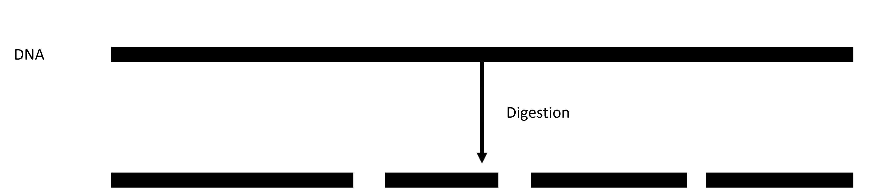
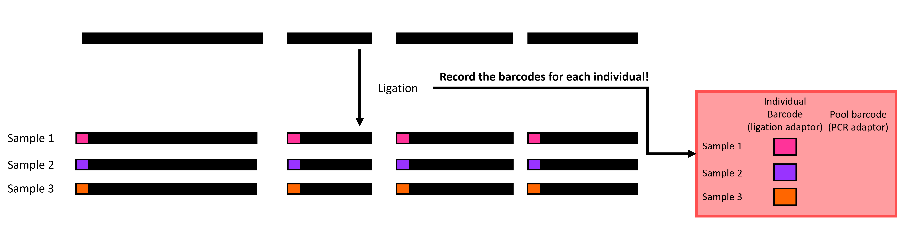
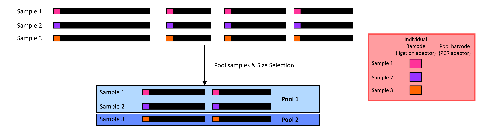
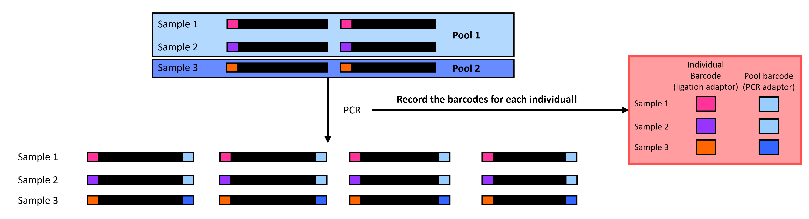
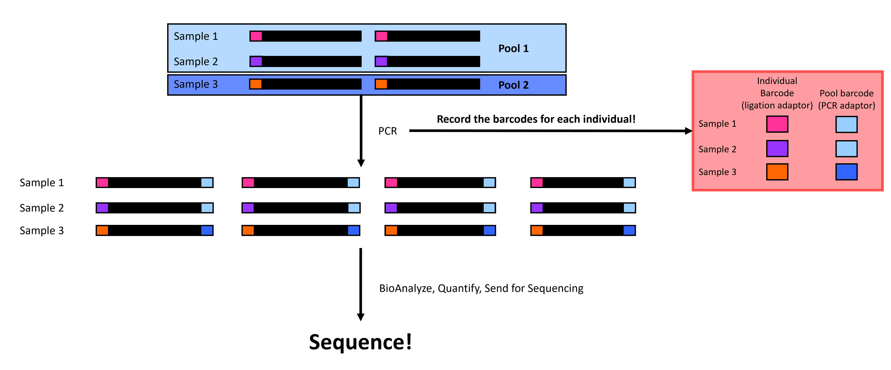

# (PART) Techniques {-}
# Double digest restriction site associated DNA sequencing (ddRADseq)

*Updated by Keaka Farleigh on March 3rd, 2024*

*Reviewed by: Joe Zianno*

## Purpose

This chapter provides a basic overview of ddRADseq accompanied by visualizations to help researchers understand what is happening at each step in the workflow. If you would like detailed information on the technique, please see Peterson et al. (2012; the original paper).   

## Overview

ddRADseq is part of the restriction site-associated DNA sequencing family, which are reduced representation sequencing approaches that allow us to generate genome-wide sequence data at a lower cost than whole genome sequencing (Andrews et al., 2016). Generally, these techniques involve DNA digestion with restriction enzyme(s) and attaching adapters to assign DNA fragments to individuals; please see Andrews et al. (2016) for more details. ddRADseq allows us to identify single nucleotide polymorphisms (SNPs) that enable researchers to explore various questions in evolutionary biology, medicine, and many more subjects.

ddRADseq involves four or five major steps (depending on if you have extracted DNA or not). First, we extract DNA from tissues, then we digest the DNA with two restriction enzymes (hence the name), followed by adapter ligation, before size-selection, before polymerase chain reaction (PCR), quality-checks, and sequencing (Figure 1). We will walk through each step below.   


```{r ddRADseq wkflw viz, echo=FALSE, eval=TRUE, fig.align='center'}
knitr::include_graphics("./imgs/ddRADseq_Lab_wkflw.png")
```

**Figure 1.** A simplified double digest restriction site-associated DNA sequencing (ddRADseq) workflow. Black rectangles represent DNA, and colored rectangles represent individual-specific or pool-specific adapters. ***Please note that this figure is a _simplified_ version of ddRADseq and that the process is more complex and involves more than just adding individual-specific and pool-specific adapters (see [Liu et al., 2017](https://peerj.com/articles/3837/) for details)***. 

### Extraction

Extraction is technically not a step in ddRADseq, but we include it because you need DNA input for ddRADseq. Generally, this process involves getting a tissue/blood/scat sample and isolating the DNA. Commonly used methods include phenol-chloroform, Qiagen kits, or a paramagnetic bead protocol. 

### Digestion

Digestion sets ddRADseq apart from other RAD protocols. We use two digestion enzymes to digest the DNA into fragments (Figure 2), while some protocols use one (original RAD) or three (3RAD). Your choice of digestion enzymes is a **crucial** part of your study. We often choose enzymes that other studies have used with sister species or that we have previously used within the species. Doing so allows us to compare our data with other data generated using the same restriction enzymes. It will be difficult (if not impossible) to compare data if we use different restriction enzymes because we will end up with different random genome fragments.  

```{r ddRADseq digestion viz, echo=FALSE, eval=TRUE, fig.align='center'}

```

**Figure 2.** A visualization of digestion in ddRADseq: DNA is digested into fragments using two restriction enzymes.  


### Ligation

Ligation is where you start to feel the heat and have to trust things that you don't see. You will attach individual adapters to each sample before putting the samples in each pool together in the same tube (Figure 3)! Be sure to use unique adapter tags for individuals in the same pool so that you can tell them apart after sequencing. Note that the number of individuals in each pool is dependent on how many individual adapters you have. 

```{r ddRADseq ligation viz, echo=FALSE, eval=TRUE, fig.align='center'}

```

**Figure 3** A visualization of ligation in ddRADseq: Individual adapters (colored rectangles) are attached to each sample before individuals in the same pool are put in the same tube.  


### Size-selection

Size selection can feel like a black box because studies use different thresholds without explaining why. Size selection filters your DNA fragments in each pool to only contain fragments within a size range (Figure 4). There are a few ways to perform size selection. The old-school method is to physically cut the fragments out of a gel; the other is to use a machine such as a Pippin Prep or Blue Pippin from Sage Science to do it for you. The Pippin methods work by opening and closing a gate. The gate stays open for DNA fragments within your range but is closed when the fragments are outside your range. 

Choosing the size range can be challenging, and we would like to select a range that contains DNA fragments. One way to help you choose a size range is to run a gel or BioAnalyze the ligated samples to identify the size distribution of your fragments. Another way is to use size ranges from past studies.

```{r ddRADseq SS viz, echo=FALSE, eval=TRUE, fig.align='center'}

```

**Figure 4** A visualization of size selection in ddRADseq: we filter out small and large fragments to leave medium fragments.   

### Polymerase chain reaction (PCR)

PCR in ddRADseq is employed to amplify the DNA sequences in our pools. We also add a pool-specific adapter in PCR, allowing us to identify which pool each set of sequences belongs to (Figure 5). The sequencing center generally performs demultiplexing by pool, but this is only possible by adding these pool-specific adapters. Note that you can reuse individual adapters if you have multiple pool adapters because you can first separate the reads by the pool before separating them by individual tags. Just make sure **not to repeat combinations of individual-specific and pool-specific adapters!**

```{r ddRADseq PCR viz, echo=FALSE, eval=TRUE, fig.align='center'}

```

**Figure 5** A visualization of PCR in ddRADseq: we amplify sequences and attach pool-specific adapters (blue rectangles). 

### Sequence

Now, we quantify the DNA concentration in our samples, quality-check with a BioAnalyzer or TapeStation, and send the pools for sequencing (Figure 6)! Note that each sequencing center will have its own requirements and services, so be sure to check with them before sending the samples.

```{r ddRADseq seq viz, echo=FALSE, eval=TRUE, fig.align='center'}

```

**Figure 6** You've done it! Final checks before sequencing. 

#### Questions or comments?

Please reach out if I can help in any way or if you have questions or any comments. 

## References 
  
  - Andrews, K. R., Good, J. M., Miller, M. R., Luikart, G., & Hohenlohe, P. A. (2016). Harnessing the power of RADseq for              ecological and evolutionary genomics. Nature Reviews Genetics, 17(2), 81-92.

  - Peterson, B. K., Weber, J. N., Kay, E. H., Fisher, H. S., & Hoekstra, H. E. (2012). Double digest RADseq: an inexpensive            method for de novo SNP discovery and genotyping in model and non-model species. PloS one, 7(5), e37135.
  
  - Liu, M. Y., Worden, P., Monahan, L. G., DeMaere, M. Z., Burke, C. M., Djordjevic, S. P., ... & Darling, A. E. (2017).               Evaluation of ddRADseq for reduced representation metagenome sequencing. PeerJ, 5, e3837.


