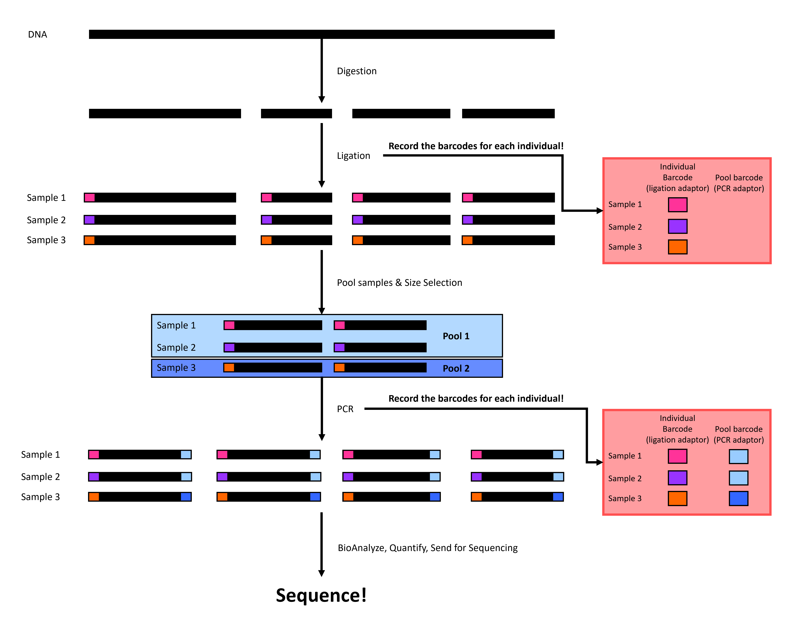

# (PART) Techniques {-}
# Double digest restriction site associated DNA sequencing (ddRADseq)

*Updated by Keaka Farleigh on March 3rd, 2024*

*Reviewed by: Joe Zianno*

## Purpose

This chapter provides a basic overview of ddRADseq accompanied by visualizations to help researchers understand what is happening at each step in the workflow. If you would like detailed information on the technique, please see Peterson et al. (2012; the original paper).   

## Overview

ddRADseq is part of the restriction site-associated DNA sequencing family, which are reduced representation sequencing approaches that allow us to generate genome-wide sequence data at a lower cost than whole genome sequencing (Andrews et al., 2016). Generally, these techniques involve DNA digestion with restriction enzyme(s) and attaching adapters to assign DNA fragments to individuals; please see Andrews et al. (2016) for more details. 

ddRADseq involves four or five major steps (depending on if you have extracted DNA or not). First, we extract DNA from tissues, then we digest the DNA with two restriction enzymes (hence the name), followed by adapter ligation, before size-selection, before polymerase chain reaction (PCR), quality-checks, and sequencing (Figure 1). We will walk through each step below.   


```{r ddRADseq wkflw viz, echo=FALSE, eval=TRUE, fig.align='center'}

```

**Figure 1.** A simplified double digest restriction site-associated DNA sequencing (ddRADseq) workflow. Black rectangles represent DNA, and colored rectangles represent individual-specific or pool-specific adapters. 


## References 
  
  - Andrews, K. R., Good, J. M., Miller, M. R., Luikart, G., & Hohenlohe, P. A. (2016). Harnessing the power of RADseq for              ecological and evolutionary genomics. Nature Reviews Genetics, 17(2), 81-92.

  - Peterson, B. K., Weber, J. N., Kay, E. H., Fisher, H. S., & Hoekstra, H. E. (2012). Double digest RADseq: an inexpensive            method for de novo SNP discovery and genotyping in model and non-model species. PloS one, 7(5), e37135.


